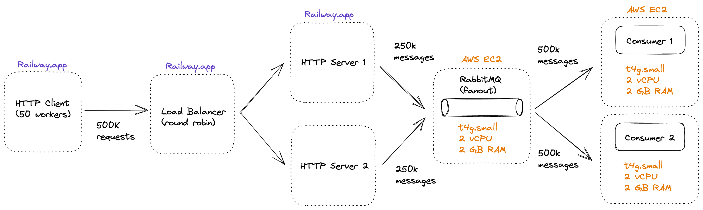
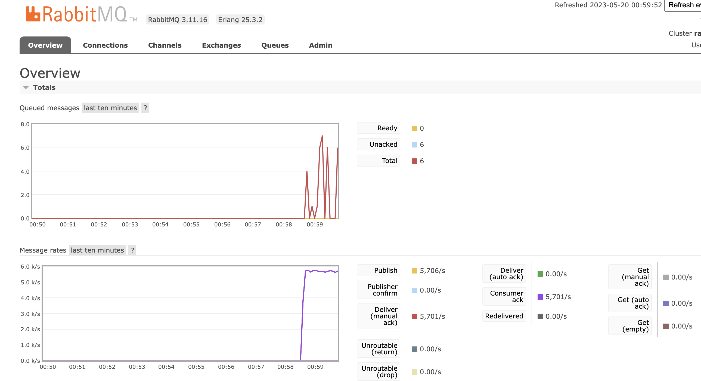
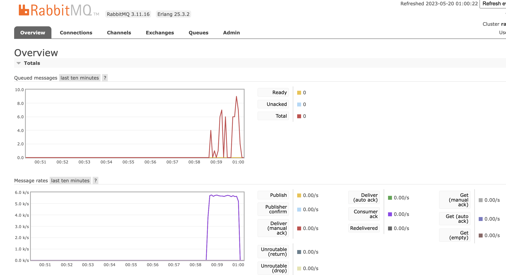

# Twinder Assignment 2

## Key Takeaways

- Self managing VM instances is painful
- Vertical scaling is much easier than horizontal scaling

## How to Build and Deploy (2 options)

### Option 1
1. Build Docker images on your local computer
2. Push image to Docker Hub
3. SSH into the VM and pull down the image
4. Docker run the image

### Option 2
1. SSH into the VM and git clone the repository
2. Docker build the image natively
3. Docker run the image

## Design

## Results

### With 1 HTTP server instance

TBD

### With 2 HTTP server instances and load balanced

The publisher and consumer rate are nearly equal which is a great sign. There are very few messages stored in the queue at any given moment. The performance is excellent since it matches the client's load production rate of roughly 5500 req/sec.